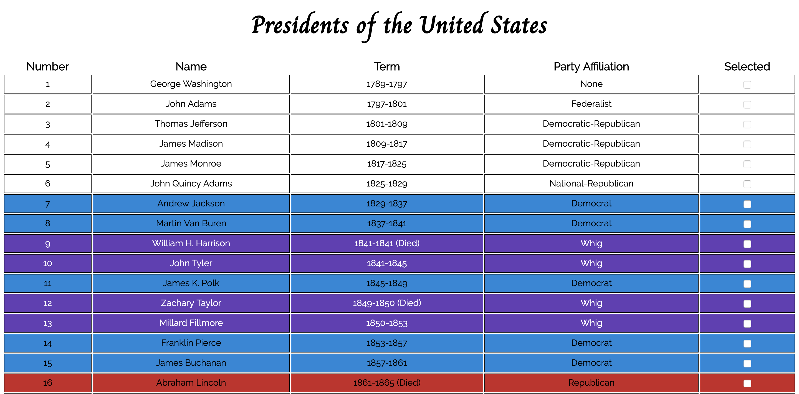

# JQuery Practice
- I created this project to practice JQuery based on a [Turing lesson](http://frontend.turing.io/lessons/module-1/introduction-to-jquery.html). 

### Preview:

### Key:
- *Blue background* = Democratic Party
- *Red background* = Republican Party
- *Purple background and white text* = 'Whig'
- No background = no party, the Federalist Party, the Democratic-Republic Party, or the National-Republican Party

### Set-Up:
* Clone this repo `https://github.com/hlhartley/jquery-practice.git`
* Open index.html in browser

### Primary Technologies Used:
* Html
* CSS
* JavaScript
* JQuery
